# Wecrker for GlassFish 5 with OpenJDK 8 on CentOS 7

Wercker を利用して CentOS 上に GlassFish5 が稼働している環境の Docker イメージを作成します。

## 説明

Wercker は Docker ベースの CI/CD 自動化プラットフォームです。
- [Wercker](http://www.wercker.com/)

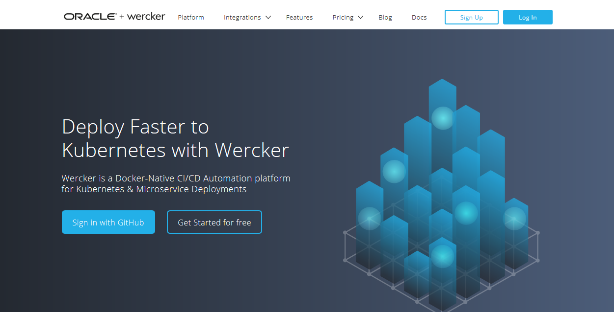

GlassFish 5 は、Java EE 8 の参照実装となる アプリケーションサーバです。現在、正式版リリースに向けて開発が進んでおり、ベータ版としてビルドされ公開されています。

- [GlassFish5](https://javaee.github.io/glassfish/download)

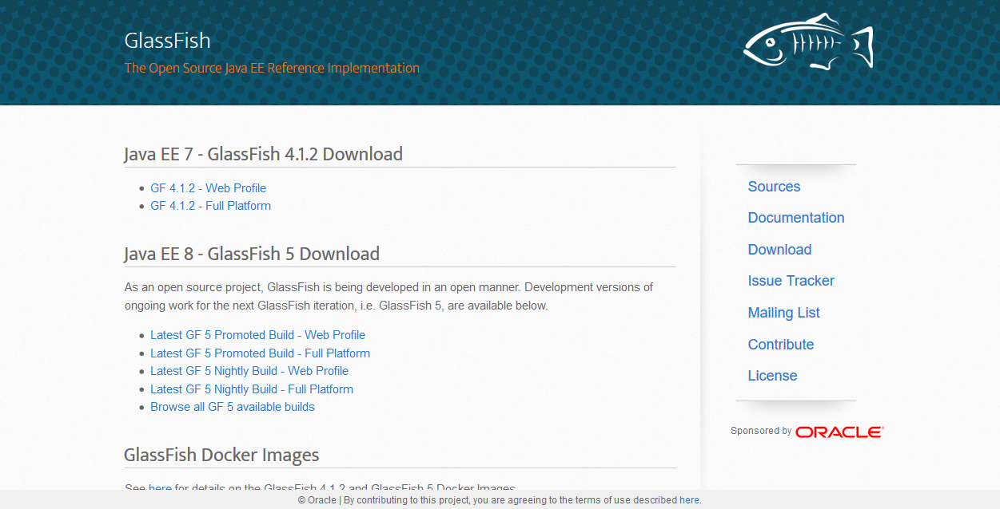

この GlassFish 5 を Docker 上に環境構築したイメージの作成について以下で説明しました:

- [Oracle Java を使って Glassfish 5 を起動する Dockerfile を作ってみた](http://qiita.com/shinyay/items/fa892f0be50a2a236dfe)

上記では、Dockerfile で Docker イメージの作成手順を定義して Docker Hub の Automated Build により Docker イメージを作成・公開しています。

今回は、Wercker を利用して、Docker イメージの作成手順を定義して Docker Hub に公開を行います。

また、以前の手順では Oracke Java と Oracle Linux という組み合わせでしたが、今回は CentOS と OpenJDK による環境とします。

## 動作イメージ


## 構築対象の環境情報

- GlassFis 5
  - Promoted ビルドによるバージョンは選択可能
- CentOS
  - Docker Hub で公開しているCentOS を使用。公開されているタグを指定可能
- Java
  - Yum リポジトリから取得可能な最新の OpenJDK 8 を導入

## 前提

以下のアカウントを所有すること:
- Wercker
- GitHub/Bitbucket
- DockerHub

## 手順

### 1. GitHub で公開しているリポジトリを取得

- [hinyay/wercker-glassfish5-openjdk-centos
](https://github.com/shinyay/wercker-glassfish5-openjdk-centos)

### 2. wercker.xml の編集

wercker.xml の以下の部分を各自の情報に変更します。

- USERNAME: DockerHub のアカウント名
- PASSWORD: DockerHub のパスワード
- DOCKER_IMAGE_NAME: 公開するイメージ名
- DOCKER_IMAGE_TAG: 公開するイメージにつけるタグ
- DOCKER_IMAGE'S_AUTHOR_NAME: 作成者情報

```
- internal/docker-push:
     username: [USERNAME]
     password: [PASSWORD]
     repository: [DOCKER_IMAGE_NAME]
     tag: [DOCKER_IMAGE_TAG]
     author: [DOCKER_IMAGE'S_AUTHOR_NAME]
     cmd: /bin/bash --login
```

これらの情報は、wercker.xml に直接記載しなくても環境変数として Wercker に設定することも可能です

### 3. Wercker Application の定義

#### 3.1. Create Application
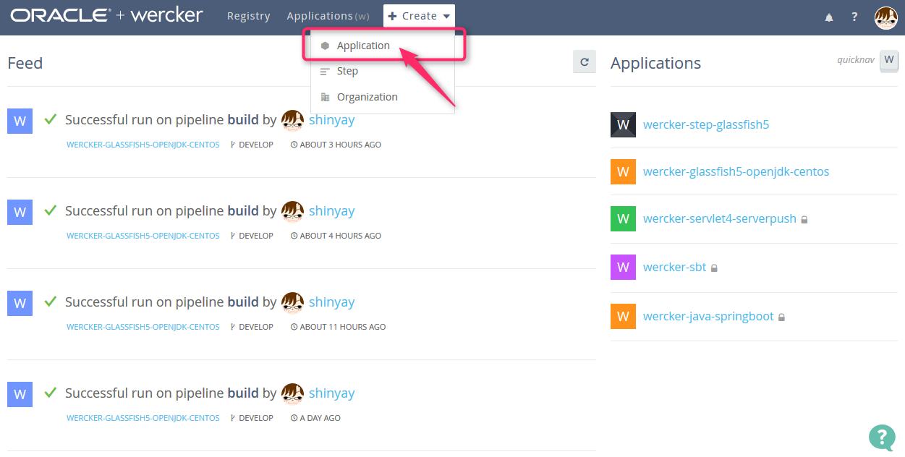

画面上部のメニューから「Create」→「Application」を選択します

#### 3.2. リポジトリの設定
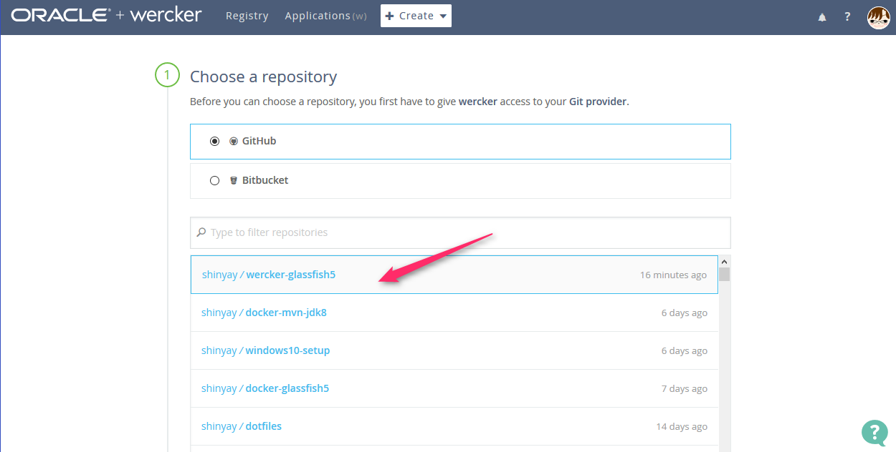

GitHub または Bitbucket を選択し、そこで管理している Wercker アプリケーションのリポジトリを選択します。

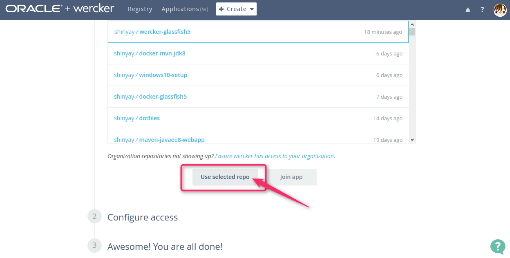

選択された状態で、「Use selected repo」をクリックします。

#### 3.3. アクセス方法の設定
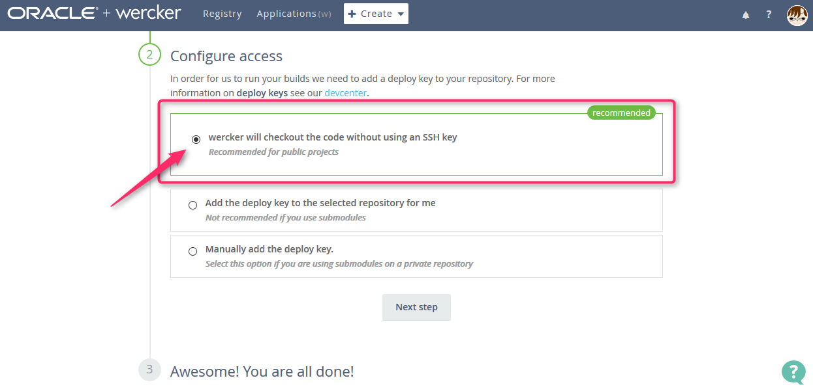

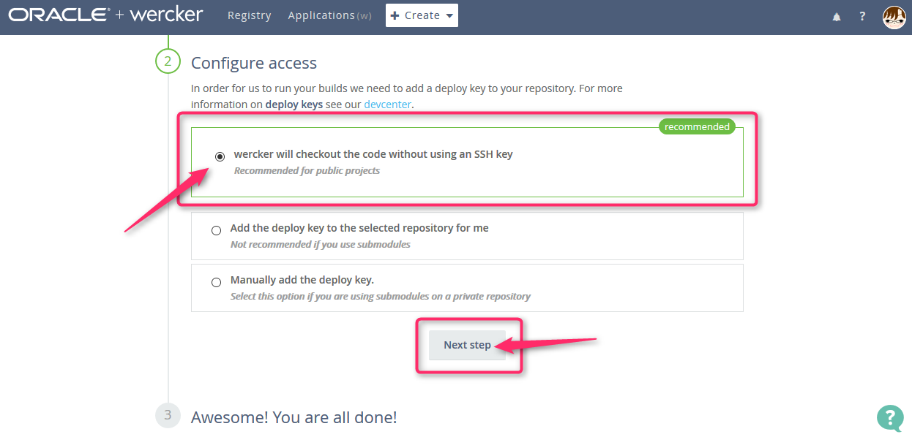

デフォルトのまま (SSH鍵を使用しない) まま「Next Step」をクリックします。

#### 3.4. 公開/非公開の選択
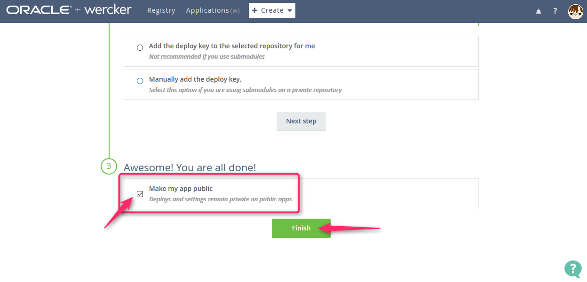

ここで作成定義をしている Wercker アプリケーションを一般公開するか、プライベートにするかを選択します。公開する場合は、「Make my app public」を選択します。

#### 3.5. ビルドの実施
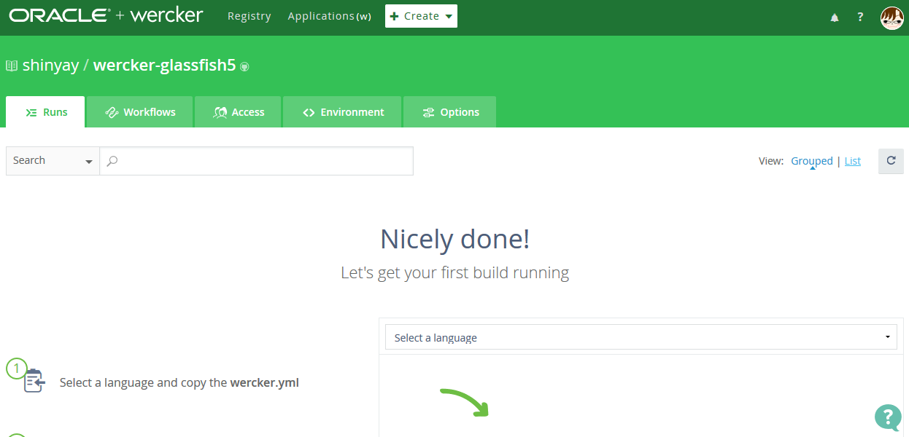

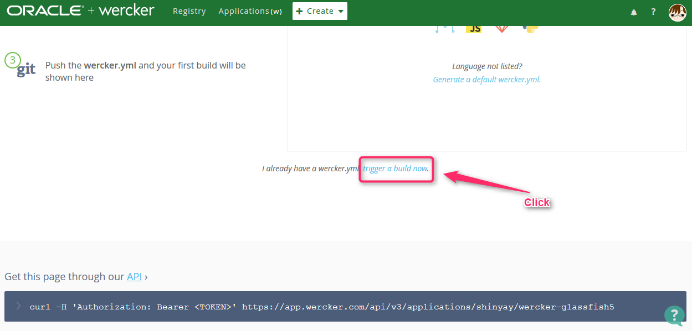

Build タブ画面に遷移した後、画面下部の 「Trigger a build now」をクリックします。

#### 3.6. 環境変数の定義
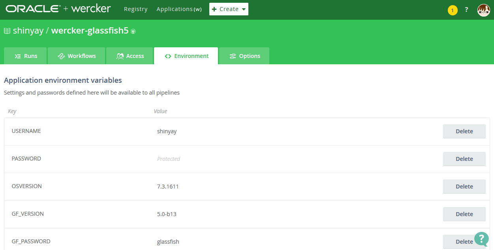

手順2. で環境変数を利用している場合は、**Environment** タブで定義を行います。パスワードのような公開したくない情報は、非表示(Protected) とする事が可能です。

#### 3.7. ビルド状況の確認
Build タグでビルドの状況がリアルタイムに確認ができます。

#### 4. Docker Hub からイメージの取得・利用
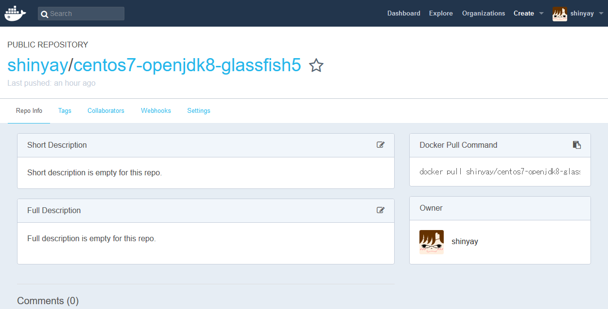

Wercker でビルドが成功すると、定義しておいたイメージ名で DockerHub に公開されます。ここから `docker pull` してイメージを利用します。

#### 5. Docker コンテナの起動
私が公開しているDockerHubのイメージは以下のように起動します:

`docker run -it --rm -p 4848:4848 -p 8080:8080 shinyay/centos7-openjdk8-glassfish5`

起動すると、直後のディレクトリには GlassFish 5 起動の簡略化のため起動用のシェル **start-domain.sh** を配置してます。これを実行すると、デフォルトドメイン (domain1) が起動します。

```
[root@4e1fb53e79af ~]# ls
anaconda-ks.cfg  start-domain.sh

[root@4e1fb53e79af ~]# ./start-domain.sh
```

起動を確認してみます

```
[root@4e1fb53e79af ~]# asadmin list-domains
domain1 running
Command list-domains executed successfully.
```

## Licence

Released under the [MIT license](https://gist.githubusercontent.com/shinyay/56e54ee4c0e22db8211e05e70a63247e/raw/44f0f4de510b4f2b918fad3c91e0845104092bff/LICENSE)

## Author

[shinyay](https://github.com/shinyay)
